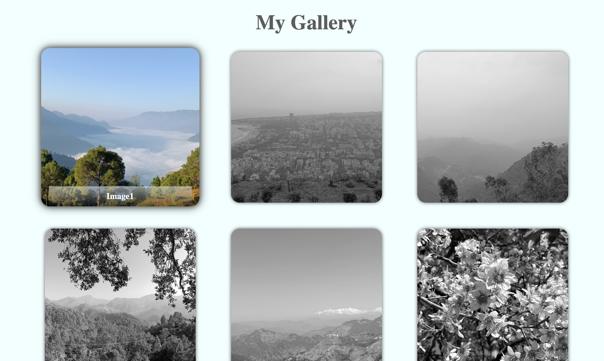
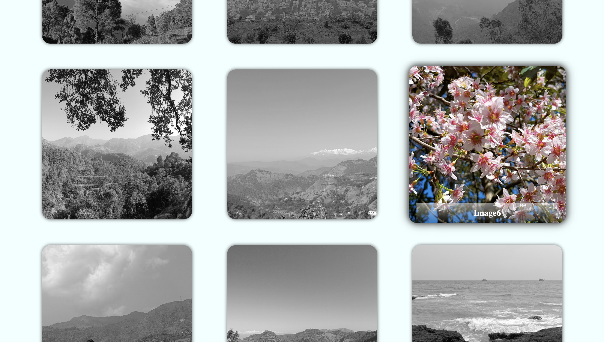

# Hey, I'm Swati Bhatt👩🏻‍💻!

# Image Gallery using Flexbox 🎞️  

Gallery of Color features a sleek photo gallery where black-and-white images gradually turn colorful using simple CSS transitions. 
Designed with Flexbox, the layout adjusts smoothly across different devices for a consistent viewing experience. Hover over an image to see it shift from grayscale to vibrant color.

[Visit Now🚀](https://swati-bhatt.github.io/GalleryUsingFlex/)

##  ☞Tech Stack Used 🖇️

##  ☞Sneak Peak 🫣

##  ☞Feedback✍🏻
I’d love to hear your thoughts on this project and would really appreciate any suggestions you have. Please feel free to reach out to me at:
get.swatibhatt@gmail.com

##  ☞Contact Me 📩

